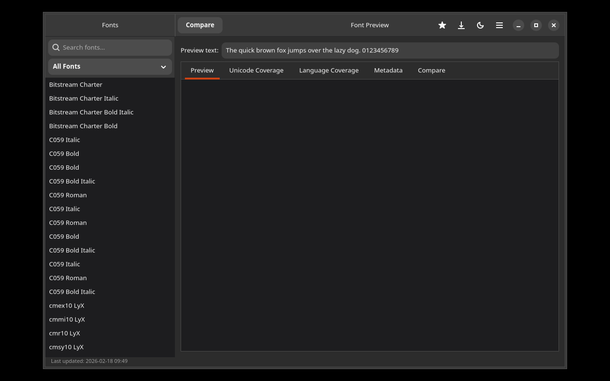

# Font Preview

A GTK4/Adwaita font viewer for Linux. Preview text in all installed fonts, compare fonts side by side, and analyze Unicode coverage.



## Features

- Browse all installed fonts via fontconfig
- Live preview — type any text and see it rendered in every font
- Compare fonts — select 2–4 fonts for side-by-side comparison
- Unicode coverage — see which Unicode blocks a font supports
- Language coverage — test if a font has all characters for a specific language
- Font metadata — view family, style, weight, and file path
- Search & filter fonts by name
- Favorites — star your preferred fonts

## Installation

### Debian/Ubuntu

```bash
# Add repository
curl -fsSL https://yeager.github.io/debian-repo/KEY.gpg | sudo gpg --dearmor -o /usr/share/keyrings/yeager-archive-keyring.gpg
echo "deb [signed-by=/usr/share/keyrings/yeager-archive-keyring.gpg] https://yeager.github.io/debian-repo stable main" | sudo tee /etc/apt/sources.list.d/yeager.list
sudo apt update
sudo apt install font-preview
```

### Fedora/RHEL

```bash
sudo dnf config-manager --add-repo https://yeager.github.io/rpm-repo/yeager.repo
sudo dnf install font-preview
```

### From source

```bash
pip install .
font-preview
```

## 🌍 Contributing Translations

Help translate this app into your language! All translations are managed via Transifex.

**→ [Translate on Transifex](https://app.transifex.com/danielnylander/font-preview/)**

### How to contribute:
1. Visit the [Transifex project page](https://app.transifex.com/danielnylander/font-preview/)
2. Create a free account (or log in)
3. Select your language and start translating

### Currently supported languages:
Arabic, Czech, Danish, German, Spanish, Finnish, French, Italian, Japanese, Korean, Norwegian Bokmål, Dutch, Polish, Brazilian Portuguese, Russian, Swedish, Ukrainian, Chinese (Simplified)

### Notes:
- Please do **not** submit pull requests with .po file changes — they are synced automatically from Transifex
- Source strings are pushed to Transifex daily via GitHub Actions
- Translations are pulled back and included in releases

New language? Open an [issue](https://github.com/yeager/font-preview/issues) and we'll add it!

## License

GPL-3.0-or-later — Daniel Nylander <daniel@danielnylander.se>
