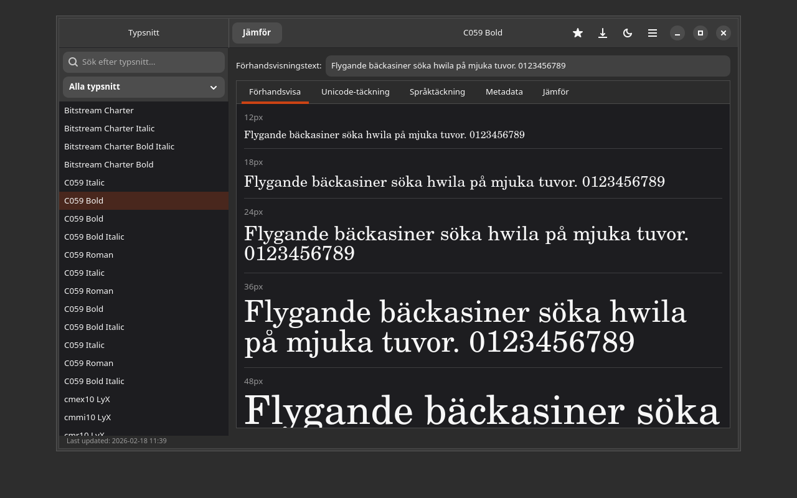

# Font Preview

## Screenshot



A GTK4/Adwaita font viewer for Linux. Preview text in all installed fonts, compare fonts side by side, and analyze Unicode coverage.


## Features

- Browse all installed fonts via fontconfig
- Live preview — type any text and see it rendered in every font
- Compare fonts — select 2–4 fonts for side-by-side comparison
- Unicode coverage — see which Unicode blocks a font supports
- Language coverage — test if a font has all characters for a specific language
- Font metadata — view family, style, weight, and file path
- Search & filter fonts by name
- Favorites — star your preferred fonts

## Installation

### Debian/Ubuntu

```bash
# Add repository
curl -fsSL https://yeager.github.io/debian-repo/KEY.gpg | sudo gpg --dearmor -o /usr/share/keyrings/yeager-archive-keyring.gpg
echo "deb [signed-by=/usr/share/keyrings/yeager-archive-keyring.gpg] https://yeager.github.io/debian-repo stable main" | sudo tee /etc/apt/sources.list.d/yeager.list
sudo apt update
sudo apt install font-preview
```

### Fedora/RHEL

```bash
sudo dnf config-manager --add-repo https://yeager.github.io/rpm-repo/yeager.repo
sudo dnf install font-preview
```

### From source

```bash
pip install .
font-preview
```

## 🌍 Contributing Translations

This app is translated via Transifex. Help translate it into your language!

**[→ Translate on Transifex](https://app.transifex.com/danielnylander/font-preview/)**

Currently supported: Swedish (sv). More languages welcome!

### For Translators
1. Create a free account at [Transifex](https://www.transifex.com)
2. Join the [danielnylander](https://app.transifex.com/danielnylander/) organization
3. Start translating!

Translations are automatically synced via GitHub Actions.
## License

GPL-3.0-or-later — Daniel Nylander <daniel@danielnylander.se>
